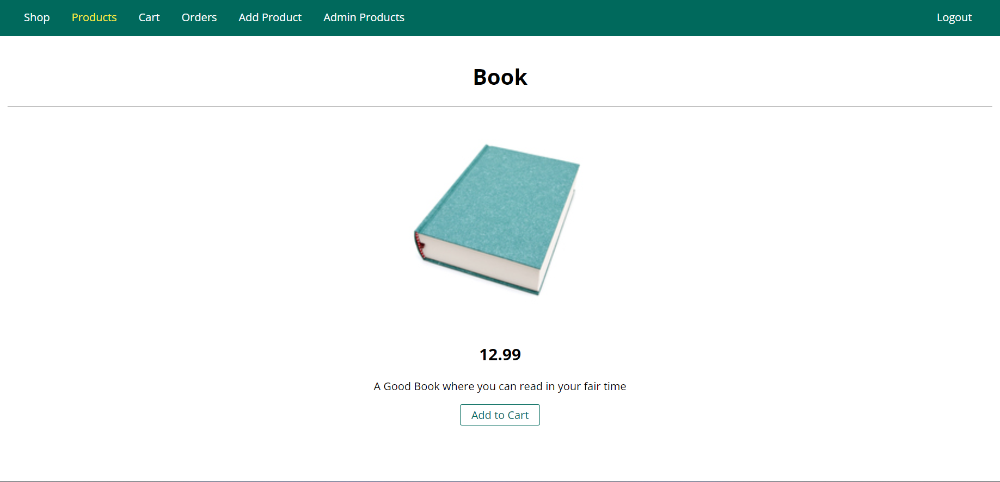
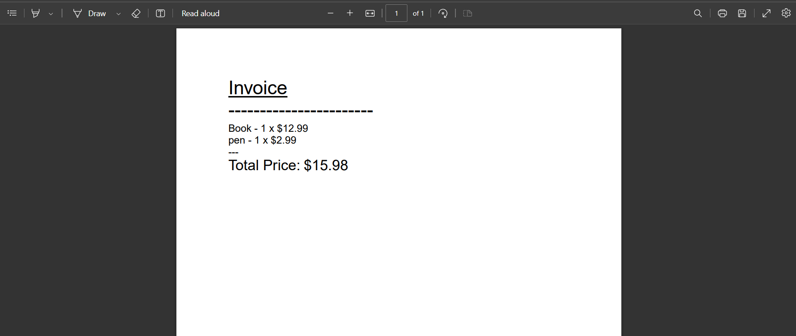
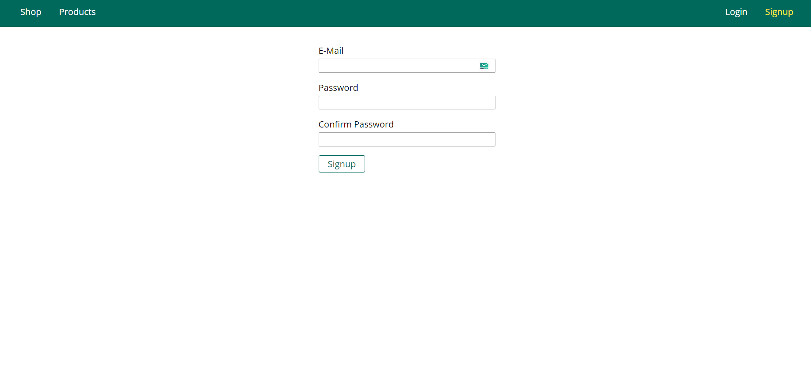
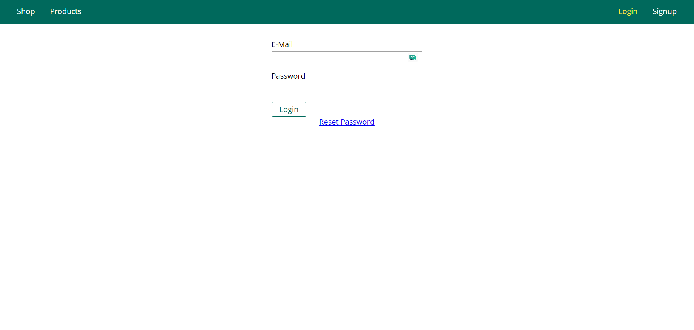
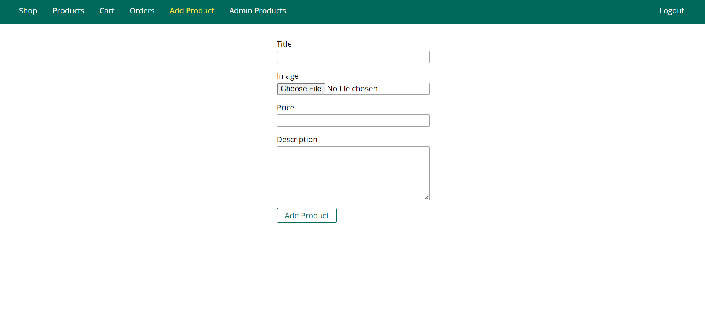
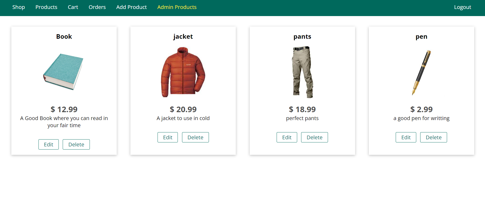

# Shop Fullstack

Welcome to the Shop Fullstack project! This is a fullstack web application that allows users to sign up, log in, navigate through products, add products to their cart, and make orders. The project includes authentication and authorization functionality, allowing users to manage their accounts and access different parts of the application.

Please note that this project's main focus is on the backend functionality. As a result, the user interface may not be as polished as a full-fledged frontend project.

## Installation

To run the project, please clone the repository using the following command:

`git clone https://github.com/khaled-farahat/Shop.git`

Then, navigate to the project directory and run the following commands to install the dependencies:

`npm install`

`npm install --force` (if it did not download all dependencies)

You will also need to download and install MongoDB locally. You can find installation instructions here: https://docs.mongodb.com/manual/administration/install-community/

Alternatively, you can use a MongoDB Atlas database by replacing the MongoDB connection string in the `.env` file.

## Usage

To start the server, run the following command in the project directory:

`npm start`

Once the server is running, you can access the application by navigating to `http://localhost:3000/` in your web browser.

The main page of the application displays a list of all products.

Clicking on "Details"" button will display more details about the product, including a larger image and a description.

To add a product to the cart, simply click the "Add to Cart" button on the product details page. You can view your cart by clicking the Cart icon.

From the cart, you can remove items from your order. When you're ready to checkout, click the "Order Now!" button to proceed to the order confirmation page.

Once your order is placed, you will be redirected to the orders page, which displays all your orders.

and by clicking on "invoice" you can see a summary of your order.

and you can sign up, login, & reset Password

 

add products

remove or edit product that you authorized to edit

#

## License

This project is licensed under the MIT License - see the [LICENSE](LICENSE) file for details.
